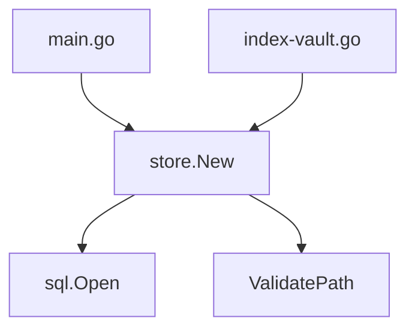

# Scouter 🕶️ (Wave 8.9 — Absolute Sovereignty)
**Status**: Sovereign. Divine Architecture (Go 1.25). Glasswall Validated. Rating 10.0.

**The high-precision, semantic code analysis engine for AI agents.**  
*Surgical AST indexing. FTS5 Semantic Search. Multi-language Tree-sitter. Global Call Graph. Ecosystem Sovereignty.*

Scouter gives AI agents (like Gemini CLI, OpenCode, and Claude Code) "X-ray vision" for your codebase. It eliminates token waste by providing surgical access to symbols and instant, cross-file impact analysis.

## 🚀 Quick Start

### 1. Build from source (Go 1.25+)
```bash
go build -o bin/scouter cmd/scouter/main.go
go build -o bin/index-vault cmd/index-vault/main.go
```

### 2. Index the Workspace
```bash
./bin/index-vault
```

---

## 🏛️ Sovereign Capabilities (v1.3.0)

Scouter runs as a high-performance **MCP (Model Context Protocol)** server with four pillars of sovereignty:

### 1. Unified Polyglot Engine
Analyzes and indexes **Go, TypeScript, JavaScript, and Python** using native AST and Tree-sitter fallbacks.
- **SHA-256 Integrity**: Every fragment contains a cryptographic signature to prevent stale reads.
- **Pure Branding**: Standardized **Fragment** nomenclature.

### 2. Global Call Graph (V2.0)
The heart of impact analysis. Scouter tracks who calls whom across the entire workspace.
- **Closure Sovereignty**: Detects calls inside anonymous functions and goroutines.
- **Visual Evidence**: Tool `scouter_visualize` generates **Mermaid.js** diagrams on the fly.

### 3. Ecosystem Sovereignty (V1.3)
Vision beyond source code. Automatically parses `go.mod` and `package.json`.
- **Version Intelligence**: Know exactly which library versions are available.
- **Dependency Mapping**: Tool `scouter_dependencies` lists the project's tech inventory.

### 4. Glasswall & OOM Guard
Military-grade security and memory protection.
- **Validation**: Strict `validator/v10` schema enforcement for all MCP inputs.
- **Memory Shields**: Hard limits on search (100) and symbol responses (500) to protect LLM context.

---

## 🧩 Integration Example

When using **Gemini CLI**, you can trigger the autonomous explanation workflow:

```bash
/scouter-explain symbolName=store.New
```

**Impact Analysis Diagram:**


## 📜 License
MIT — *Sovereignty for all.*
