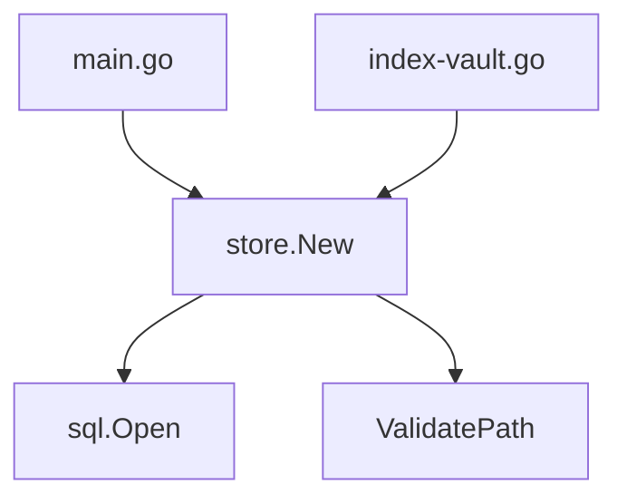

# Scouter 🕶️ (Wave 8.9 — Absolute Sovereignty)
**Status**: Sovereign. Divine Architecture (Go 1.25). Glasswall Validated. Rating 10.0.

**The high-precision, semantic code analysis engine for AI agents.**  
*Surgical AST indexing. FTS5 Semantic Search. Multi-language Tree-sitter. Global Call Graph. Ecosystem Sovereignty. Ghost Speed. Knowledge Indexing.*

Scouter gives AI agents (like Gemini CLI, OpenCode, and Claude Code) "X-ray vision" for your codebase. It eliminates token waste by providing surgical access to symbols and instant, cross-file impact analysis.

## 🚀 Quick Start

### 1. Build from source (Go 1.25+)
```bash
go build -o bin/scouter cmd/scouter/main.go
go build -o bin/index-vault cmd/index-vault/main.go
```

### 2. Index the Workspace (Ghost Speed ⚡)
```bash
./bin/index-vault
```

---

## 🏛️ Sovereign Pillars (v1.7.0)

Scouter is built on seven pillars of technical sovereignty:

### 1. Ghost Speed (Selective Indexing) ⚡
Incremental indexing engine that skips unchanged files using SHA-256 pre-flight hashing. Reach speeds of **+750 files/sec**.

### 2. Global Call Graph (v2.0) 🕸️
Tracks who calls whom across the entire workspace. Includes **Closure Sovereignty**, capturing invocations inside goroutines, closures, and anonymous functions.

### 3. Documentation Sovereignty 📚
Indexes **GoDoc, JSDoc, and Python Docstrings**. Provides agents with 'Intent Visibility'—understanding *why* a symbol exists without reading its implementation.

### 4. Ecosystem Sovereignty 📦
Vision beyond source code. Automatically parses `go.mod` and `package.json` to map project dependencies and their exact versions.

### 5. Dead Code Analysis (Hakai) 💀
Identifies unused symbols across the workspace, differentiating between internal dead code and potentially unused public APIs.

### 6. Parallel Engine 🧬
High-performance **Worker Pool** architecture. Uses all available CPU cores for AST parsing while maintaining atomic SQLite transactions.

### 7. Glasswall Security 🛡️
Military-grade input validation. Every MCP request is strictly checked via `validator/v10` and protected by OOM Guards.

---

## 🛠️ MCP Toolset (Functionalities)

Scouter exposes the following tools to any connected AI agent:

| Tool | Capability |
| :--- | :--- |
| `scouter_index` | Analyze and index a specific file's AST and calls. |
| `scouter_search` | FTS5 semantic search across definitions and documentation. |
| `scouter_read` | Surgical fragment reading with SHA-256 integrity check. |
| `scouter_callers` | List all project-wide invocations of a symbol. |
| `scouter_visualize` | Generate a **Mermaid.js** diagram of a symbol's dependencies. |
| `scouter_dependencies` | List all indexed Go and NPM libraries/versions. |
| `scouter_dead_code` | Audit the project for orphan symbols to be purged. |
| `scouter_status` | Real-time indexing statistics via `@scouter://status`. |

---

## 🧩 Integration Example

When using **Gemini CLI**, use the slash command for autonomous analysis:

```bash
/scouter-explain symbolName=store.New
```

**Visual Evidence (Mermaid.js):**


## 📜 License
MIT — *Sovereignty for all.*
