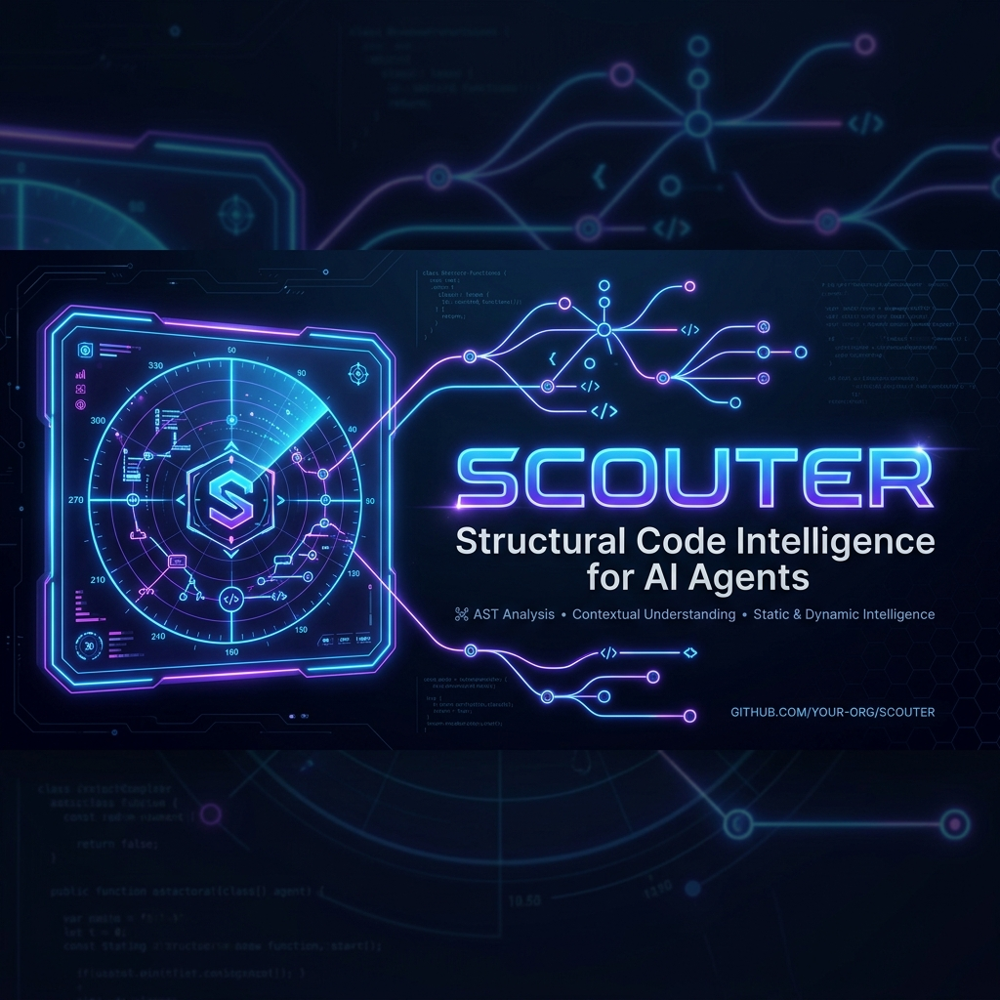
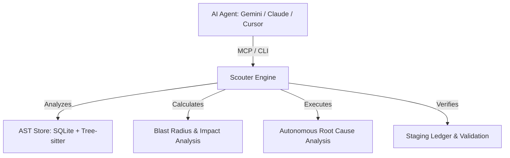

<p align="center">
  
</p>

<p align="center">
  <strong>Structural Analysis & Reconnaissance for AI Agents</strong><br>
  <em>Deep AST inspection. Impact analysis. Automated healing.</em>
</p>

<p align="center">
  <a href="#-quick-start">Quick Start</a> &bull;
  <a href="docs/INSTALLATION.md">Installation</a> &bull;
  <a href="docs/AGENT-SETUP.md">Agent Setup</a> &bull;
  <a href="docs/ARCHITECTURE.md">Architecture</a> &bull;
  <a href="docs/CODEBASE-GUIDE.md">Codebase Guide</a> &bull;
  <a href="CONTRIBUTING.md">Contributing</a>
</p>

---

> **scouter** `/ˈskaʊ.tər/` — _reconnaissance_: a tool that explores codebases to gather structural intelligence and predict the impact of changes.

**Scouter** is the "tactical visor" for your AI coding agents. While [Engram](https://github.com/Gentleman-Programming/engram) provides the **Brain** (Memory), Scouter provides the **Eyes** (Structural Analysis). While others see text, Scouter sees the **Abstract Syntax Tree (AST)**.



## 🚀 Quick Start

### 1. Install

```bash
go install github.com/Rogercode97/scouter/cmd/scouter@latest
```

### 2. Setup Your Agent

| Agent                       | One-liner / Setup                                                                 |
| --------------------------- | ---------------------------------------------------------------------------------- |
| Gemini CLI                  | `scouter setup gemini-cli`                                                        |
| Claude Code                 | `claude plugin install $(which scouter)`                                          |
| VS Code / Cursor            | Add MCP: `{"command": "scouter", "args": ["mcp"]}`                                |
| Other Agents                | See [docs/AGENT-SETUP.md](docs/AGENT-SETUP.md)                                   |

### 3. Start Reconnaissance

```bash
scouter index .             # Map the codebase
scouter predict             # Predict affected tests from git diff
cat telemetry.jsonl | scouter ingest --env production # Map runtime telemetry to AST symbols
```

## 🛠️ MCP Tools

Scouter exposes its intelligence via **27 specialized tools** for agents:

| Category               | Tools                                                                 |
| ---------------------- | --------------------------------------------------------------------- |
| **Intelligence**       | `index`, `search`, `read`, `type_info`                                |
| **Impact & Flow**      | `impact`, `callers`, `goto_definition`                                |
| **Autonomous Healing** | `self_heal` (RCA -> Fix -> Verify)                                    |
| **Refactoring**        | `ripple_refactor`, `scouter_commit`, `scouter_rollback`, `scouter_diff` |

> **Core Invariant:** Validation is finality. No destructive mutation is applied without passing through the Staging Ledger and Impact Analysis.

## 🏗️ Key Capabilities

*   **Impact Analysis (Blast Radius):** Calculate exactly which files and symbols will break before you even touch the code.
*   **Ripple Protocol:** Atomic, multi-file symbol refactoring that maintains structural integrity across the entire project.
*   **Autonomous Healing (Shinigami):** Automated RCA (Root Cause Analysis) that fixes tests and verifies the solution in a loop.
*   **Token Optimization:** High-density data serialization and adaptive context windowing to keep your agent's context lean and fast.

## 📚 Documentation

| Resource | Description |
| :--- | :--- |
| [Architecture](./docs/ARCHITECTURE.md) | Deep dive into the Engine, Store, and MCP layers. |
| [Codebase Guide](./docs/CODEBASE-GUIDE.md) | Landmarks, domain boundaries, and logic maps. |
| [Security Policy](./SECURITY.md) | Staging ledger and safe mutation protocols. |
| [Contributing](./CONTRIBUTING.md) | Standards for extending the Scouter AST engine. |

---

**Inspired by [Engram](https://github.com/Gentleman-Programming/engram)** — providing the eyes to go with the brain.

## Contributors

<a href="https://github.com/Rogercode97/scouter/graphs/contributors">
  
</a>

*MIT License*
