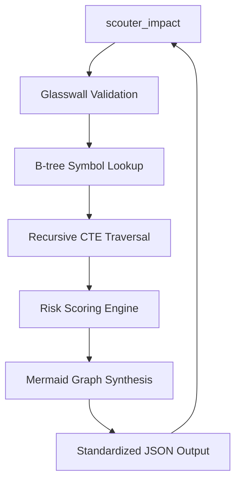

# Design: Impact Analysis Engine (Omniscience Edition)

## Technical Approach
The Impact Analysis Engine provides a recursive, entity-level traversal to identify the "blast radius" and **Predictive Risk Score** of a change. We will implement this using a **Recursive Common Table Expression (CTE)** in SQLite. To support Wave 9 "Divine Sovereignty," we prioritize **B-tree precision** and implement a multi-factor risk scoring system.

## Architecture Decisions

### Decision: Risk Scoring Implementation
| Option | Tradeoff | Decision |
|--------|----------|----------|
| **On-the-fly Calculation** | Higher query latency; always reflects current graph state. | **Chosen** |
| **Pre-calculated Table** | Fast lookup; requires complex triggers or post-index jobs; stale data risk. | Rejected |

**Rationale**: Risk scores should reflect the latest index state. By using CTE results, we can calculate the transitive "Blast Radius" score dynamically without stale data issues.

### Decision: Visual Mapping Strategy
| Option | Tradeoff | Decision |
|--------|----------|----------|
| **SVG/Image Generation** | Heavy; requires external dependencies (Chromium/Node); non-interactive. | Rejected |
| **Mermaid.js String** | Lightweight; zero dependencies; rendered by UI/Agents; interactive. | **Chosen** |

**Rationale**: Mermaid.js strings are the "Pure Signal" format for visual graphs.

## Data Flow


## Risk Scoring Engine Logic
The engine calculates a score $R \in [0.0, 1.0]$ based on the following weights:
- **Centrality ($W_c = 0.4$)**: Normalized count of immediate unique callers.
- **Blast Radius ($W_b = 0.4$)**: Normalized count of total transitive callers found in the traversal.
- **Public Exposure ($E = 0.2$)**: Binary flag ($1$ if exported, $0$ if internal).

$$R = (Centrality \times 0.4) + (BlastRadius \times 0.4) + (Exported \times 0.2)$$

## Mermaid Graph Synthesis
The system will build a directed graph string by iterating over the CTE results:
1. Initialize `graph TD`.
2. For each relationship `A calls B`, append `A["file/A"] --> B["file/B"]`.
3. Use entity names as node IDs and file paths as node labels for clarity.

## File Changes

| File | Action | Description |
|------|--------|-------------|
| `internal/types/types.go` | Modify | Add `ImpactResult`, `ImpactEntity`, and `RiskMetrics`. |
| `internal/store/store.go` | Modify | Update `GetImpact` with Recursive CTE and Risk Scoring. |
| `internal/store/migrations.go`| New | Add `indegree` and `link_type` columns to `calls`. |
| `cmd/scouter/main.go` | Modify | MCP registration with `mermaid` output support. |

## Interfaces / Contracts

### Repository Update
```go
type ImpactEntity struct {
    Symbol    string  `json:"symbol"`
    File      string  `json:"file"`
    Distance  int     `json:"distance"`
    RiskScore float64 `json:"risk_score"`
}

type ImpactResult struct {
    Target    ImpactEntity   `json:"target"`
    Callers   []ImpactEntity `json:"callers"`
    Mermaid   string         `json:"mermaid"`
    RiskLevel string         `json:"risk_level"` // Low, Medium, High, Critical
}
```

### Optimized Recursive CTE
```sql
WITH RECURSIVE impact(symbol, file, distance) AS (
    -- Anchor: Immediate callers of the target entity
    SELECT DISTINCT caller_name, path, 1
    FROM calls
    WHERE callee_name = :name
      AND (callee_path = :path OR :path = '')
    
    UNION
    
    -- Recursive Step: Find callers of the callers
    SELECT DISTINCT c.caller_name, c.path, i.distance + 1
    FROM calls c
    JOIN impact i ON c.callee_name = i.symbol
                 AND (c.callee_path = i.file OR c.callee_path = '')
    WHERE i.distance < :maxDepth
)
SELECT symbol, file, distance FROM impact;
```

## Testing Strategy
- **Risk Validation**: Verify that deleting a high-centrality symbol (e.g., `main.go` entry point) results in a `RiskScore > 0.8`.
- **Mermaid Accuracy**: Ensure the generated string is a valid Mermaid graph with correct directions.
- **Cycle Immunity**: Confirm `UNION` prevents infinite loops in recursive structures.

## Performance Guards
- **Compound Index**: `CREATE INDEX idx_calls_impact ON calls(callee_name, callee_path, caller_name, path);`
- **Path Cache**: Use a `map[string]string` to cache resolved symlinks during the analysis turn to avoid redundant syscalls.

