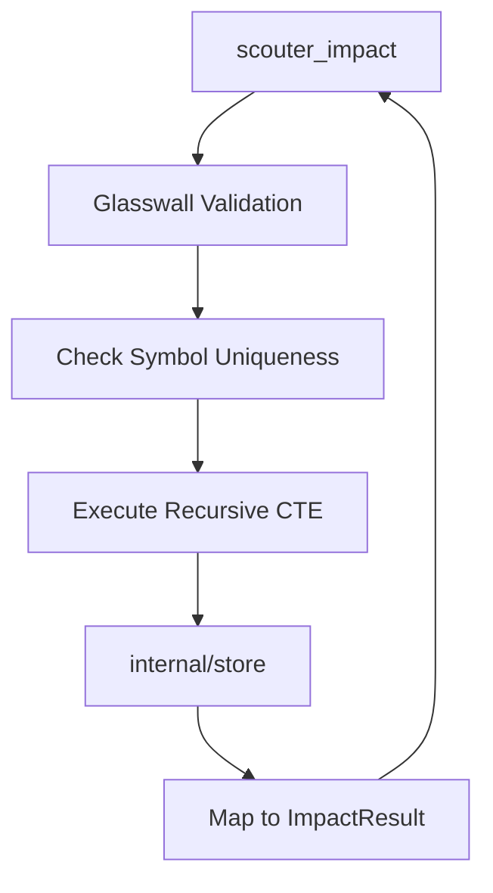

# Design: Impact Analysis Engine

## Technical Approach
The Impact Analysis Engine will provide a recursive caller traversal to identify the "blast radius" of a symbol change. We will implement this using a **Recursive Common Table Expression (CTE)** in SQLite to perform the graph traversal efficiently in a single query. To support the "Precise Disambiguation" requirement, we will update the `calls` table schema to include `callee_path`, allowing the engine to distinguish between calls to symbols with the same name defined in different files.

## Architecture Decisions

### Decision: Recursive CTE vs. Application-level BFS
| Option | Tradeoff | Decision |
|--------|----------|----------|
| **Application BFS** | High memory usage for large graphs; multiple DB roundtrips. | Rejected |
| **Recursive CTE** | Complex SQL; SQLite specific; extremely efficient; handles cycles natively. | **Chosen** |

**Rationale**: SQLite's `RECURSIVE CTE` with `UNION` (not `ALL`) automatically handles cycle detection by eliminating duplicates. It performs the entire traversal in the database engine, minimizing data transfer and latency.

### Decision: Schema Update for Call Precision
| Option | Tradeoff | Decision |
|--------|----------|----------|
| **Name-only Graph** | Simple; current parser works; prone to false positives (ambiguity). | Rejected |
| **Path-qualified Graph** | Requires `callee_path` column; more accurate; satisfies disambiguation specs. | **Chosen** |

**Rationale**: The specification requires tracing callers "ONLY for the [symbol] defined in [file]". This is impossible without storing which file a call is targeting. We will add `callee_path` to the `calls` table.

## Data Flow
The data flow starts from the MCP tool, validates input, disambiguates the starting symbol if necessary, and executes the recursive query.



## File Changes

| File | Action | Description |
|------|--------|-------------|
| `internal/types/types.go` | Modify | Add `ImpactResult` and `ImpactRequest` structs. |
| `internal/store/store.go` | Modify | Update `Repository` interface and `migrate` function. Add `GetImpact` implementation. |
| `cmd/scouter/main.go` | Modify | Register `scouter_impact` tool and handle requests. |
| `internal/engine/parser.go` | Modify | Update `ASTCall` to include `CalleePath` (optional/initial). |

## Interfaces / Contracts

### Repository Update
```go
type ImpactResult struct {
	Symbol   string `json:"symbol"`
	File     string `json:"file"`
	Distance int    `json:"distance"`
}

type Repository interface {
    // ...
    GetImpact(ctx context.Context, symbolName, filePath string, maxDepth int) ([]ImpactResult, error)
}
```

### Recursive CTE Query
```sql
WITH RECURSIVE impact(symbol, file, distance) AS (
    -- Anchor: Immediate callers of the target symbol
    SELECT DISTINCT caller_name, path, 1
    FROM calls
    WHERE callee_name = :name
      AND (callee_path = :path OR :path = '')
    
    UNION
    
    -- Recursive Step: Find callers of the callers
    SELECT DISTINCT c.caller_name, c.path, i.distance + 1
    FROM calls c
    JOIN impact i ON c.callee_name = i.symbol
                 AND (c.callee_path = i.file OR c.callee_path = '')
    WHERE i.distance < :maxDepth
)
SELECT symbol, file, distance 
FROM impact 
ORDER BY distance ASC;
```

## Testing Strategy

| Layer | What to Test | Approach |
|-------|-------------|----------|
| Unit | CTE Logic | Mock `Repository` with complex graph (cycles, deep chains) and verify `GetImpact` results. |
| Integration | SQLite CTE | Real SQLite database with sample `calls` and `symbols` to verify SQL syntax and recursion. |
| E2E | MCP Tool | Call `scouter_impact` via MCP and verify JSON output matches spec. |

## SQL Optimizations (Future)
To ensure performance as the codebase grows:
1. **Compound Index**: `CREATE INDEX idx_calls_lookup ON calls(callee_name, callee_path, caller_name, path);` (Covering index for the CTE join).
2. **Path Index**: `CREATE INDEX idx_calls_path ON calls(path);` for faster cleanup during re-indexing.
3. **FTS5 Integration**: Use `symbols_fts` to quickly find the `filePath` for a `symbolName` if it's missing from the request.

## Open Questions
- [x] Should we perform full resolution at index time? *Decision: No, keep indexing fast. Use empty string for unknown callee paths and rely on fuzzy name matching for those.*
- [ ] What is the hard cap for `maxDepth`? *Recommendation: 10 as per specs.*
