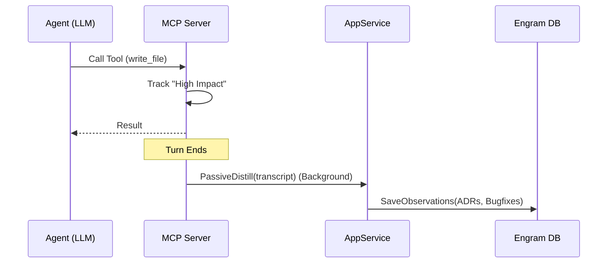

## Design: Dream Ascension: Passive Engram Capture

### Architectural Changes

#### 1. Domain Layer: `AppService.PassiveDistill`
- **Location**: `internal/domain/memory/service.go`
- **Function**: `PassiveDistill(ctx context.Context, project string, transcript []Message) error`
- **Logic**:
  1. Filter transcript for relevant messages (User/Assistant).
  2. Call `Distiller.DistillTranscript`.
  3. For each distilled item:
     - Check if a similar observation exists in Engram (fuzzy hash or exact content match).
     - Save as a new `Observation`.

#### 2. Infrastructure Layer: `MCPDistiller` Update
- **Location**: `internal/adapters/llm/mcp_distiller.go`
- **New Method**: `DistillTranscript(ctx context.Context, transcript []memory.Message) ([]memory.Observation, error)`
- **Prompting**: Use the `buildExtractCombinedPrompt` pattern from the case study, but tailored for Engram types.

#### 3. MCP Layer: `TurnEndHook`
- **Location**: `internal/mcp/handlers.go`
- **Logic**:
  - Add a `HookRegistry` or simple logic within the main tool-call handler.
  - After `sampling` (if using sampling) or at the end of the session, check the `High-Impact` heuristic.
  - **High-Impact Heuristic**:
    - Turn resulted in `write_file` or `replace` calls.
    - Turn used `git commit`.
    - Turn context length exceeded a threshold (e.g., 2000 tokens).

### Sequence Diagram

### Data Integrity & Performance
- **Deduplication**: Use a hash of the `Content` field to skip duplicate saves.
- **Resource Management**: The background goroutine MUST use a separate `context.Context` with a timeout (e.g., 30s) to avoid lingering processes if the parent session terminates.
- **SQLite Safety**: Ensure `WAL` mode is enabled (Scouter already does this) to handle concurrent writes from the background extraction.
